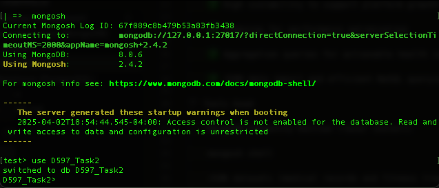

# Non-Relational Database Management

📦 HealthFit Innovations - NoSQL Database Project

This project was completed as part of the Non-Relational Database Design and Implementation course. It involves designing and implementing a NoSQL database solution for HealthFit Innovations, a health technology company integrating fitness tracker data with patient medical records to provide proactive healthcare insights.
📌 Project Overview

HealthFit Innovations is building HealthTrack, a platform that combines data from wearable fitness trackers and electronic medical records. The goal is to help healthcare providers and patients monitor health trends in real time, detect early warning signs, and support personalized care decisions.

The company needed a flexible and scalable database solution to handle the increasing volume and variety of data collected from multiple devices and patient records.
🧩 Solution

A NoSQL document database was designed and implemented using MongoDB. The solution organizes data into two collections:

    medical_records - stores patient information, medical conditions, medications, and appointment history.

    fitness_data - contains fitness tracker product information, such as brand, battery life, and customer ratings.

The database supports fast queries and future scalability to handle growing data volume from the HealthTrack platform.
🔍 Key Features

    ✅ Flexible schema design for varying patient and device data

    ✅ High scalability to support platform growth

    ✅ Indexing for performance optimization

    ✅ Aggregation queries for actionable health insights

    ✅ JSON data import and efficient NoSQL querying

🛠️ Tools Used

    MongoDB Community Edition (local install)

    mongosh shell

    JSON datasets (medical records and fitness trackers)

    Homebrew for installation

📊 Sample Queries

    Identify patients using trackers with no recent appointments

    Find fitness tracker brands with the highest average customer ratings

    List devices with the longest average battery life

🚀 Performance Optimization

Indexing strategies were applied to improve query run times:

    Indexes on last_appointment_date, Tracker, Brand Name, Rating (Out of 5), and Average Battery Life (in days)

    Before-and-after execution times recorded for performance comparison

🧭 Outcomes

    Implemented and validated a NoSQL solution

    Imported JSON data into MongoDB

    Ran and optimized queries to support HealthFit business goals

    Documented processes and results for academic and professional use
